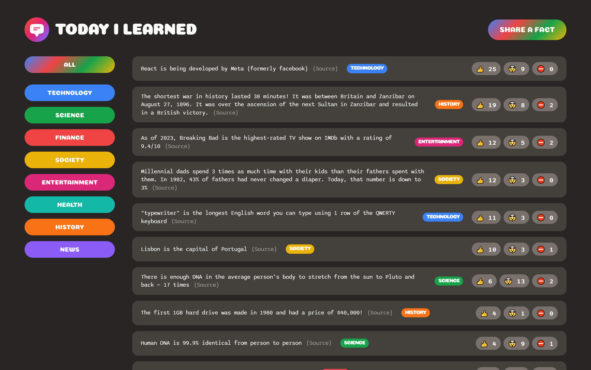

# Today I Learned 
  

This is a React Javascript project that i re-built using typescript. It is from the udemy course "Build a Full Stack Web App" I used the idea of the app from the course and wrote the code on my own to test my knowledge of React with JavaScript and then Typescript. I did reference the course for CSS to better my skills of CSS with React. Supabase is used to store the data.

Users can filter facts by category, share a new fact, upvote, downvote and dispute facts. Future improvements to the app will include user authentication.

## What I Learned From This Project

- Improve and demonstrate typescript proficiency
- Improved CSS knowledge with React
- Usage of react on its own without the ionic framework
- Gained further knowledge of the react framework
- Gained more experience in databases with Supabase (PostgreSQL)
- Furthered my understanding of state management in React.

## Installation

Fork/download the repository and run:

`npm install`

`npm start`

## Link

View the app on netlify [here](https://today-i-learned-tm.netlify.app/)

## Screenshots

## Credits

Course created by Jonas Schmedtmann:
[Build a Full Stack Web App](https://www.udemy.com/course/full-stack-crash-course/)
